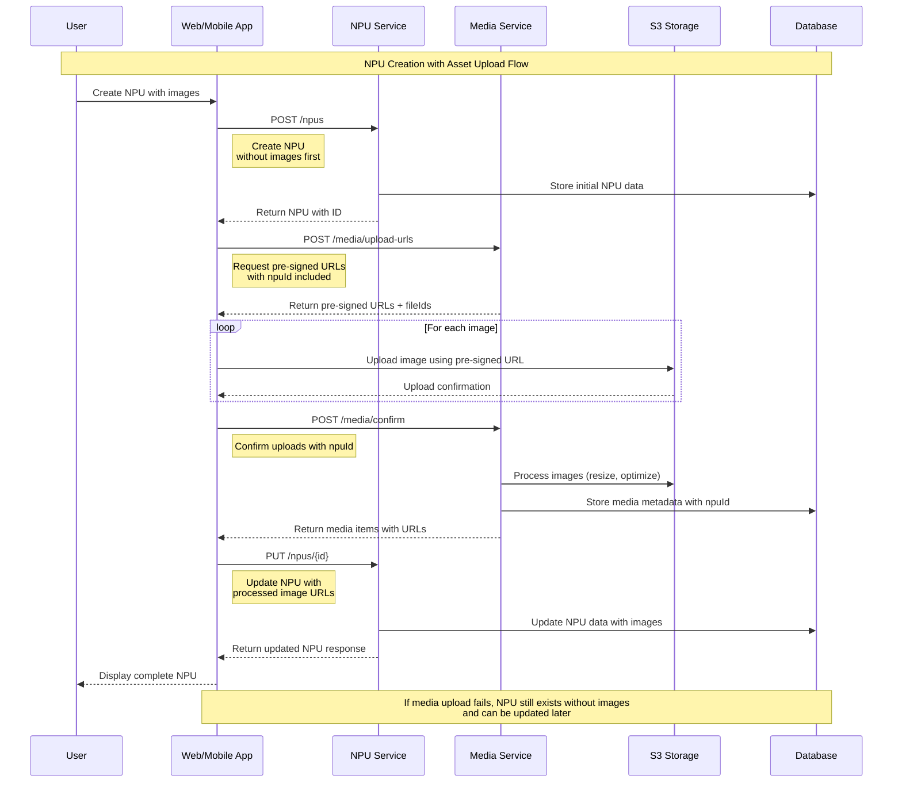

```mermaid
sequenceDiagram
    participant User as User
    participant Client as Web/Mobile App
    participant NPU as NPU Service
    participant Media as Media Service
    participant S3 as S3 Storage
    participant DB as Database

    Note over User, DB: NPU Creation with Asset Upload Flow
    
    User->>Client: Create NPU with images
    
    Client->>NPU: POST /npus
    Note right of Client: Create NPU<br/>without images first
    
    NPU->>DB: Store initial NPU data
    NPU-->>Client: Return NPU with ID
    
    %% Handle media uploads
    Client->>Media: POST /media/upload-urls
    Note right of Client: Request pre-signed URLs<br/>with npuId included
    
    Media-->>Client: Return pre-signed URLs + fileIds
    
    loop For each image
        Client->>S3: Upload image using pre-signed URL
        S3-->>Client: Upload confirmation
    end
    
    Client->>Media: POST /media/confirm
    Note right of Client: Confirm uploads with npuId
    
    Media->>S3: Process images (resize, optimize)
    Media->>DB: Store media metadata with npuId
    Media-->>Client: Return media items with URLs
    
    %% Update NPU with images
    Client->>NPU: PUT /npus/{id}
    Note right of Client: Update NPU with<br/>processed image URLs
    
    NPU->>DB: Update NPU data with images
    NPU-->>Client: Return updated NPU response
    
    Client-->>User: Display complete NPU
    
    Note over Client, DB: If media upload fails, NPU still exists without images<br/>and can be updated later
```
